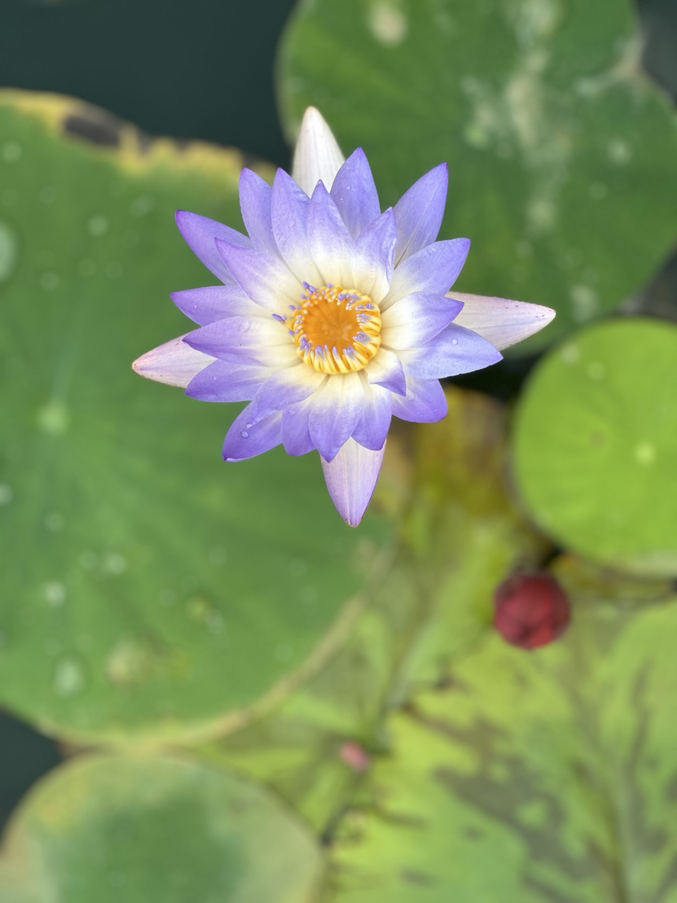

# 🛠️ Deep Kotadia — Portfolio Editing Guide

A complete reference for editing your portfolio.
Use **Cmd+F** (Mac) / **Ctrl+F** (Windows) in VS Code to jump to any section instantly.

---

## 📁 File Structure

Your site is **two pages** that share one stylesheet and one script. All assets live in an `assets/` folder:

```
mywebsite/
├── index.html              ← "About" page (hero, skills, education, experience, contact)
├── work.html               ← "Work" page (projects, publications, certifications)
├── PORTFOLIO_GUIDE.md      ← this guide
└── assets/
    ├── css/styles.css      ← ALL styling for both pages
    ├── js/script.js        ← theme toggle, mobile menu, scroll reveals
    ├── docs/Resume.pdf      ← your resume (linked from the About page)
    └── images/             ← profile photo + gallery photos
        ├── img.png             profile photo
        ├── piano.jpeg          gallery
        ├── cycle.jpeg          gallery
        └── click1.jpeg … click13.jpeg   gallery
```

**Rule of thumb:** to reference any asset from an HTML file, always use the `assets/...` path.
Example: ``, `<link href="assets/css/styles.css">`.

Open the project in VS Code:
```bash
code .
```

---

## 🚀 Preview & Deploy

**Preview locally** — just double-click `index.html` to open it in your browser, or right-click → "Open with Live Server" in VS Code.

**Deploy** (if hosted on GitHub Pages):
```bash
git add .
git commit -m "describe what you changed"
git push
```
Your live site updates within ~60 seconds.

---

## 🎨 1. COLORS

All colors are CSS variables at the top of **`assets/css/styles.css`**. Search for `:root`.
The site has a **dark theme** (default) and a **light theme** — each has its own block.

```css
:root {                      /* DARK theme */
  --bg:#08090a;              /* page background (near black) */
  --surface:#0f1114;         /* card backgrounds */
  --surface2:#161920;        /* nested/input backgrounds */
  --accent:#7dffb3;          /* GREEN — main accent, headings, links */
  --accent2:#4ff0e1;         /* TEAL — secondary accent */
  --warn:#f59e0b;            /* AMBER — badges, warnings */
  --text:#e8eaed;            /* main body text */
  --muted:#6b7280;           /* dimmed text */
  --muted2:#4b5563;          /* very dimmed text, tags */
  --border:rgba(255,255,255,0.07);   /* subtle borders */
  --max:960px;               /* max page width */
  --radius:10px;             /* card corner radius */
}

[data-theme="light"] {       /* LIGHT theme — mirror any change here too */
  --bg:#fafbfc; --surface:#ffffff;
  --accent:#059669; --accent2:#0891b2; --warn:#d97706;
  --text:#1f2937; ...
}
```

> ⚠️ **Change a color in BOTH blocks** (`:root` and `[data-theme="light"]`) so dark and light modes stay consistent.

### Change the accent color (e.g. green → purple)
```css
/* in :root */            --accent:#a78bfa; --accent2:#818cf8;
/* in [data-theme=light] */ --accent:#7c3aed; --accent2:#6366f1;
```

### Colors to try
| Color | Dark hex | Light hex |
|-------|----------|-----------|
| Neon green (current) | `#7dffb3` | `#059669` |
| Electric blue | `#60a5fa` | `#2563eb` |
| Soft purple | `#a78bfa` | `#7c3aed` |
| Hot pink | `#f472b6` | `#db2777` |
| Cyan | `#22d3ee` | `#0891b2` |

---

## 🔤 2. FONTS

The site uses **Poppins** (loaded via Google Fonts) for everything — headings and body.
The `<link>` is at the top of **both** `index.html` and `work.html`:

```html
<link href="https://fonts.googleapis.com/css2?family=Poppins:ital,wght@0,300;0,400;0,500;0,600;0,700;1,400;1,500&display=swap" rel="stylesheet">
```

### To change the font
1. Pick a font at [fonts.google.com](https://fonts.google.com) → "Get embed code".
2. Replace the `<link>` in **both** HTML files.
3. In `assets/css/styles.css`, update the `font-family` (search `font-family:'Poppins'` — it appears on `body` and `.sec-title`, replace both).

```css
body      { font-family:'YourFont', sans-serif; }
.sec-title{ font-family:'YourFont', sans-serif; }
```

---

## 🖼️ 3. PROFILE PHOTO

Your photo is **already set** — it's `assets/images/img.png`, shown in [index.html](index.html) (search `about-photo`):

```html
<div class="about-photo">
  
</div>
```

- **To swap it:** replace `assets/images/img.png` with a new file of the same name (no HTML change needed), or use a new filename and update the `src`.
- **Adjust the crop:** change `object-position:center 28%` (lower the % to show more of the top).
- **Resize the circle:** in `styles.css`, search `.about-photo` and change `width`/`height` (keep them equal).
- **Keep photos small:** square, ~600–800px, under ~400 KB. Compress at [squoosh.app](https://squoosh.app).

---

## 🌅 4. THE PHOTO GALLERY ("Through My Lens")

In [index.html](index.html), search `lens-grid`. Each photo is one line:

```html
<div class="lens-photo"></div>
```

- **Add a photo:** drop the file into `assets/images/`, then copy one `lens-photo` line and point `src` at your new file.
- **Remove a photo:** delete its `lens-photo` line.
- **Always keep** `loading="lazy"` — it makes the page load faster.
- ⚠️ **Compress before adding.** Phone photos are 5–13 MB each; resize to ~1600px / under ~1 MB so the page stays fast.

---

## 📄 5. RESUME

Your resume is **already linked**. In [index.html](index.html) (search `Download Resume`):

```html
<a href="assets/docs/Resume.pdf" target="_blank" class="btn btn-outline">Download Resume ↓</a>
```

To update it, just replace `assets/docs/Resume.pdf` with your new PDF (same filename = no HTML change).
Add a `download` attribute (`... target="_blank" download ...`) if you want it to download instead of open in a tab.

---

## ➕ 6. ADD A NEW PROJECT  (work.html)

In [work.html](work.html), search `projects-list`. Copy one `proj-item` block and edit it:

```html
<div class="proj-item reveal">
  <div class="proj-left">
    <div class="proj-meta">
      <span class="proj-badge ml">Scientific ML</span>      <!-- badge: ml / llm / chem / eng -->
      <span class="proj-date-inline">Month Year — Month Year</span>
    </div>
    <h3 class="proj-title">Your Project Title</h3>
    <p class="proj-desc">One sentence describing the project.</p>
    <ul class="proj-highlights">
      <li>Key achievement with a number if possible</li>
    </ul>
    <div class="proj-tags"><span class="proj-tag">Python</span><span class="proj-tag">PyTorch</span></div>
    <div class="proj-links"><span class="proj-link soon">Link coming soon</span></div>
  </div>
  <div class="proj-right">
    <div class="proj-result">95%</div>            <!-- the big metric on the right -->
    <div class="proj-result-label">Accuracy</div>
  </div>
</div>
```

- Add `featured` to the class (`proj-item featured reveal`) to highlight a project.
- **Badge colors:** `ml` (green), `llm` (teal), `chem` (amber), `eng` (gray).
- **Add a real link** — replace the "Link coming soon" line with:
  ```html
  <div class="proj-links"><a class="proj-link" href="https://github.com/Deeppkotadia/your-repo" target="_blank">View on GitHub ↗</a></div>
  ```

---

## 📚 7. ADD A PUBLICATION  (work.html)

Search `pub-list`. Each entry is a clickable card — copy one and edit:

```html
<a class="pub-card reveal" href="https://doi.org/your-doi" target="_blank" rel="noopener">
  <div class="pub-num">05</div>                       <!-- update the number -->
  <div class="pub-body">
    <div class="pub-title">Full title of your paper or patent</div>
    <div class="pub-venue">Published in <strong>Journal Name</strong> · Year · Vol/Pages</div>
    <span class="pub-type paper">Journal Paper</span>   <!-- "paper" or "patent" -->
  </div>
</a>
```

---

## 🎓 8. ADD A CERTIFICATION  (work.html)

Search `cert-grid`. Each cert is a one-line clickable card:

```html
<a class="cert-card" href="https://your-certificate-url" target="_blank" rel="noopener"><div class="cert-issuer">Issuer</div><div class="cert-name">Certificate Name</div></a>
```

For an **in-progress** cert (not yet clickable):
```html
<div class="cert-card ongoing"><div class="cert-issuer">FreeCodeCamp</div><div class="cert-name">Python Certification</div><span class="cert-status">In progress</span></div>
```

---

## 💼 9. ADD AN EXPERIENCE ENTRY  (index.html)

Search `exp-table`. Add a `<tr>` row:

```html
<tr>
  <td><span class="exp-dot"></span>Month YYYY — Month YYYY</td>
  <td>
    <div class="exp-role">Your Role</div>
    <div class="exp-org">Organization &nbsp;·&nbsp; Location</div>
    <ul class="exp-points"><li>What you did and its impact</li></ul>
  </td>
</tr>
```
Use `exp-dot` for a current role, `exp-dot dim` for a past one.

---

## 📝 10. EDIT "WHAT I'M WORKING ON"  (index.html)

Search `id="now"` and `id="beyond"`. Update the `<li>` items and the "Currently" rows.
Keep this fresh — it signals to visitors that you're active.

---

## 🔧 11. QUICK FIXES CHEATSHEET

| What you want to change | Search for | File |
|---|---|---|
| Your name | `about-name` | index.html |
| Browser tab title | `<title>` | both files |
| Email | `kotadiadeep2489@gmail.com` | both (replace all) |
| Phone | `9328066226` | index.html |
| GitHub link | `github.com/Deeppkotadia` | both |
| LinkedIn link | `linkedin.com/in/deep-kotadia` | both |
| Accent color | `--accent:` | styles.css (both theme blocks) |
| Page width | `--max:` | styles.css |
| Nav links / menu items | `nav-links` / `mob-menu` | both |

> 💡 **Global replace** in VS Code: **Cmd+Shift+F** (Mac) / **Ctrl+Shift+F** searches across *all* files at once — perfect for updating an email or link everywhere.

---

## 💡 Pro Tips

1. **Edit `styles.css` once, both pages update** — they share the same stylesheet.
2. **Compress images before adding** → [squoosh.app](https://squoosh.app). Big images = slow site.
3. **Test the theme toggle** (🌙 / ☀️ button in the nav) after color changes — check both modes.
4. **Check mobile** — in browser DevTools press Cmd/Ctrl+Shift+M for mobile view.
5. **Keep `assets/` tidy** — images in `images/`, the PDF in `docs/`, nothing loose in the root.
6. **Back up before big edits** — copy the folder, or `git stash` if using Git.
</content>
</invoke>
